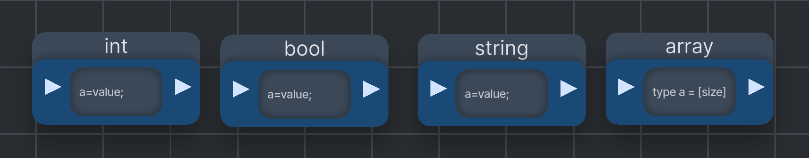
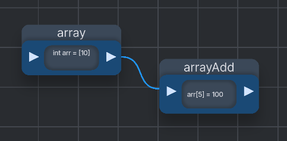
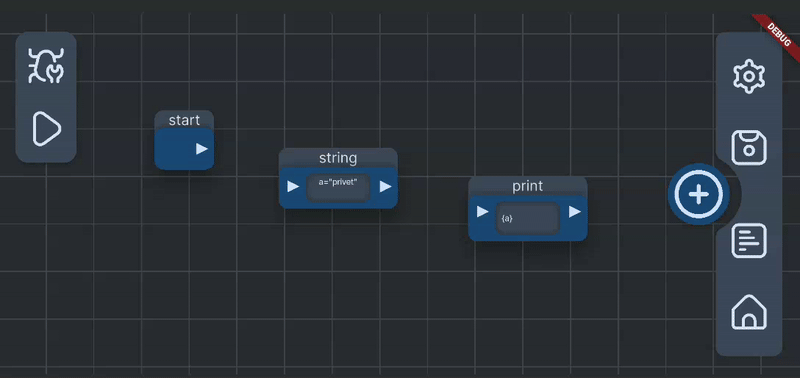

# HitsBlox
## Проект по мобильной разработке интерпретатора в стиле Blueprints в рамках 7-го учебного модуля Высшей IT-школы 

## Используемые технологии:

- **Dart** + **Flutter**

## Над приложением работали:
- **[Лемешонок Дмитрий](https://github.com/dlemesonok0)**
- **[Григорьев Владислав](https://github.com/aspakaramych)**
- **[Машковцев Глеб](https://github.com/mkenopsia)**

# Краткое руководство

## Поддерживаемые интерпретатором типы данных:
<table>
    <tr>
        <th>Тип данных</th>
        <th>Способ присвоения</th>
    </tr>
    <tr>
        <td>Int</td>
        <td>name = 123;</td>
    </tr>
    <tr>
        <td>String</td>
        <td>name = "123"</td>
    </tr>
    <tr>
        <td>Bool</td>
        <td>name =t rue/false</td>
    </tr>
    <tr>
        <td>Static Array</td>
        <td>datatype name = [size] || datatype name = {value1, value2, value3}</td>
    </tr>
</table>

Вместо значения переменной можно присвоить другую переменную по типу:

int a = 10;  
int newVar = a;

в соответствующих блоках

Для изменения элементов массива по индексу использутся блок "Добавление в массив":

## Поддерживаемые интерпретатором функции:
<table>
    <tr>
        <th>Функция</th>
        <th>Действие</th>
    </tr>
    <tr>
        <td>Add</td>
        <td>Сложение двух чисел</td>
    </tr>
    <tr>
        <td>Substract</td>
        <td>Вычитание</td>
    </tr>
    <tr>
        <td>Multiply</td>
        <td>Умножение двух чисел</td>
    </tr>
    <tr>
        <td>Divide</td>
        <td>Деление двух чисел</td>
    </tr>
    <tr>
        <td>Mod</td>
        <td>Нахождение остатка от деления</td>
    </tr>
    <tr>
        <td>Mod</td>
        <td>Нахождение остатка от деления</td>
    </tr>
    <tr>
        <td>Swap</td>
        <td>Смена местами значений двух переменных / элементов массива</td>
    </tr>
    <tr>
        <td>Increment</td>
        <td>Инкремент значения данной переменной</td>
    </tr>
    <tr>
        <td>Concat</td>
        <td>Конкатенация строковых переменных</td>
    </tr>
    <tr>
        <td>More, less, equals</td>
        <td>Сравнение двух переменных</td>
    </tr>
    <tr>
        <td>Length</td>
        <td>Получение длины массива</td>
    </tr>
    <tr>
        <td>Print</td>
        <td>Вывод информации / значения переменной/массива в консоль</td>
    </tr>
</table>

## Интерпретатор также поддерживает:
- **Условные конструкции if/else | if/else if/.../else**
- **Циклы While**

# Работа с блоками:

Для начала работы разместите блок Start -  с него начинается выполнение программы

Для соединения двух блоков нажмите на выходную стрелку первого блока, а затем на входную стрелку второго блока.  

Для удаления соединения между блоками повторите действия в том же порядке.